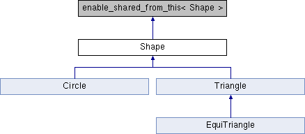

# Polinsma
C++ POlymorphic INhertiance example with SMArt pointers

The example attempts to provide a modern C++ implementation of the following concepts:
  * Polymorphism
  * Smart pointers
  * Containers
using the standard library.

The classes are organized as follows:

